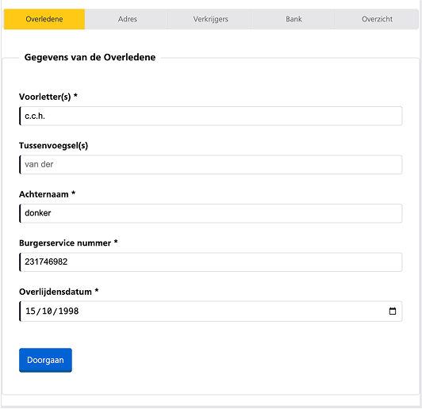
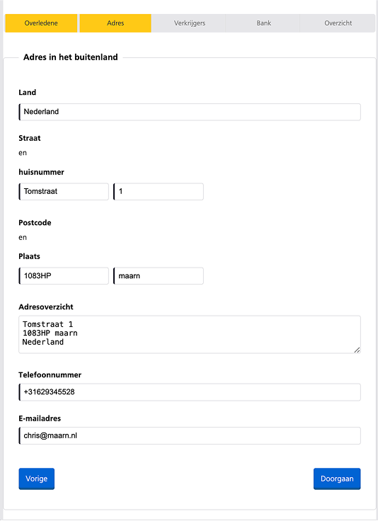
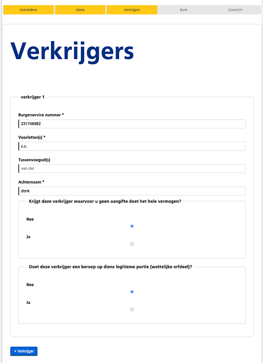
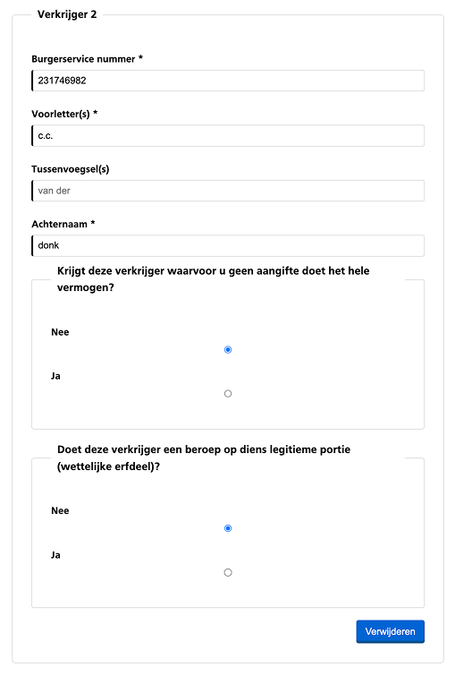
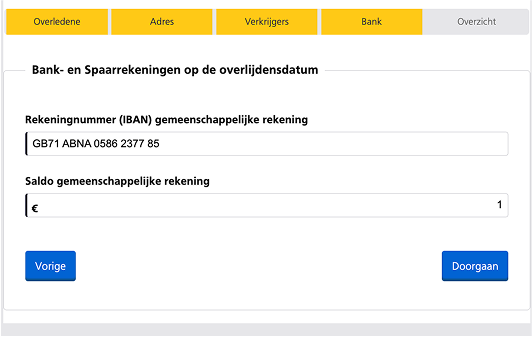
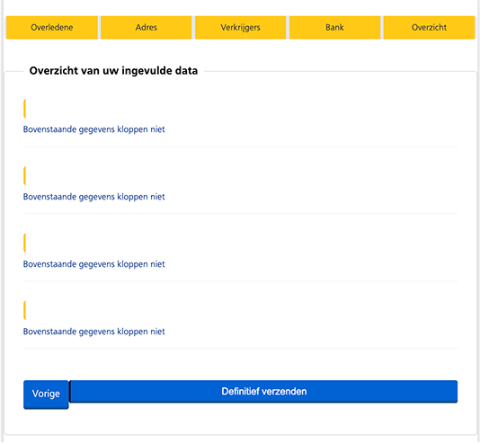
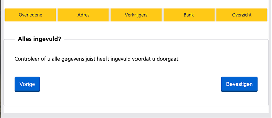

# Browser Technology

Vier weken lang heb ik me verdiept in HTML, CSS en JavaScript om een digitaal formulier te ontwerpen en bouwen. Van experimenteren met componenten in CodePen tot het structureren van de code in VS Code—dit project laat zien hoe ik stap voor stap een gebruiksvriendelijk en toegankelijk formulier heb ontwikkeld.

Benieuwd naar de uitdagingen, feedback en het eindresultaat? Duik in mijn proces en ontdek hoe ik dit project heb opgebouwd! 🚀

  
Wekelijkse progressie

  
  ## Week 1: Project Initiatie

Deze week lag de focus op het bedenken van een concept en het uitvoeren van de eerste experimenten:

Hierin ben ik gaan onderzoeken hoe ik de eerste elementen voor de website kan gaan bouwen. Hiervoor ben ik in mijn VS code een begin gaan maken om het eerste formulier te gaan bouwen. Het logo van de belastingdienst kwam erbij, een font wat op NS-Sans lijkt had ik op het internet gevonden en in het project gestopt. 

### Vrijdag Feedback #1

Tijdens het feedback gesprek van vrijdag liet ik mijn werk zien, en kwam ik erachter dat ik niet op de beste manier ben begonnen zowel met de code als met het ontwerp. Want het doel was dat er eigenlijk helemaal niks van de belastingdienst in terug komt, behalve dan de content dat het om erfbelasting gaat.
Voor de rest moest ik daar de stap naar omzetten en dan zou ik vanaf volgende week een beter beeld moeten kunnen krijgen.

## Week 2: Input ontwerpen & Feedback op Toegankelijkheid

Deze week ben ik verder gegaan met de feedback die ik de vrijdag ervoor had gekregen. Ik heb ervoor gekozen om te kijken naar welke elementen en elemenenten secties er als patronen voorbij komen in het formulier van de belastingdienst. Hierna had ik besloten om VS code heel even achter me te laten en de verschillende delen op CodePen te gaan testen.

#### CodePen form elements bouwen

Op CodePen heb ik de verschillende input types die ik had gezien, in het klein gebouwd. Ook ben ik een aantal verschillende componenten uit de NS style guide gaan bouwen (inclusief transities).

#### Van CodePen terug naar VS Code
Toen ik weer een beetje zeker was van de verschillende componenten die ik had gebouwd, had ik de stap terug naar VS Code weer gemaakt.
Hieronder een aantal code structuren die ik verwerkt heb.

### Vrijdag Feedback #2

## Week 3: CodePen zo slecht nog niet

Mijn plan van vorige week om mijn gemaakte werk van codepen over te zetten naar mijn vs code, was een goed plan maar daar lag eigenlijk niet mijn doel. Mijn doel was deze week eigenlijk om de pure html structuur neer te zetten, dus daar was vscode wel de beste plek voor. Opzoek door het document van de erfbelasting kwam ik vele patterns tegen waar input velden gebruikt werden, en daar maakte ik een selectie van.
### De onderwerpen waar ik voor gekozen heb:
<ul>
  <li><a href="https://codepen.io/Christian199815/pen/pvoWXvR">Informatie overledene</a></li>
  <li><a href="https://codepen.io/Christian199815/pen/GgROJvY">Adres in het buitenland</li>
  <li><a href="https://codepen.io/Christian199815/pen/vEYWOrz">Verkrijgers</a></li>
  <li><a href="https://codepen.io/Christian199815/pen/NPWwgJj">IBAN rekening</a></li>
</ul>

De onderwerpen hierboven zijn gelinkt aan de verschillende codepen's die ik heb gemaakt voor de verschillende fieldsets. Dit is een manier van coderen die ik heb ontwikkeld om op een voor mij overzichtelijkere en rustigere manier te kunnen coderen.

## Week 4: Toch weer naar VS code & de laatste loodjes
In de laatste week ben ik met de laatste merge begonnen. Ik zorgde ervoor dat ik alle functionaliteiten die ik in mijn Codepen's had gebouwd over zette naar mijn VS code project.

### Terugblik van Browser Technology
Als ik zo terug kijk naar het vak heb ik een hoop nieuwe dingen geleerd op het gebied van wat er allemaal mogelijk is met Html en Css. Ik heb veel feedback kunnen krijgen op mijn werk door de gesprekjes met Vasilis en Krijn. Ik heb veel nieuwe dingen geleerd als we het hebben over toegankelijkheid. 
Maar wat ook meespeelt is dat ik een aantal keer tijdens deze weken met mn haren in het hoofd heb gezeten omdat ik de structuur van de opdracht niet helemaal goed begreep. Dit is wel verbetert in de loop van het proces, maar heeft er ook voor gezorgd dat ik in de laatste weken echt de meeste stappen heb gezet naar mijn einddoel.  
Wat mij ondduidelijk was en wat me eigenlijk wel heeft tegengewerkt is het aantal patronen wat ik in mijn eindopdracht heb moeten verwerken. Ik heb uiteindelijk 4 patronen ingebouwd, maar vermoed dat de keuze om deze 4 te doen wel er toe heeft geleid dat er een aantal functies nu niet werken wat ik erg jammer vindt.    
Een leerdoel wat ik dan ook zal meenemen naar mijn volgende projecten binnen deze minor is dat ik vanaf het begin een hoop minder hooi op mijn vork zal gaan nemen. Ik start klein, werk dit uit. Daarna zal ik pas gaan uitbreiden, eerst zorgen voor een goede basis.

  
Het Resultaat

  ## NS Erfbelasting 2023
  Na vier weeken zwoegen heb ik deze websitie gemaakt waar in ik delen van het erfbelasting fysieke formulier heb omgezet. 
  Dit digitale formulier is gemaakt om te werken zonder javascript, maar met javascript zijn er een aantal enhancements om het     gemakkelijker te maken voor de gebruiker. 

  <b>Wanneer de tekst bold is zal dit te maken hebben dat dit er zo uit ziet MET Javascript</b> 
  <i>Wanneer de tekst italic is zal dit te maken hebben dat dit er zo uit ziet ZONDER Javascript</i>

  ## Opbouw met Javascript
   
  Deze intro tekst is voor de gebruiker om te lezen waar het formulier over gaat. Wat er van de gebruiker wordt verwacht, maar ook wat de gebruiker kan verwachten. Deze tekst en titel zijn in principe ook wat de gebruiker zou lezen als Javascript niet werkt. Maar de progressiebalk onderaan is niet wat zichtbaar zou zijn, dit is een enhancement waarvoor ik heb gekozen om deze alleen met javascript te doen.
   
  Wanneer de gebruiker van start gaat met het invullen van het formulier is deze fieldset het eerste deel wat hij/zij/hen zal gaan invullen. Hier gaat het over de informatie over de persoon die is overleden. Hiervoor moet de gebruiker de voorletters invullen van de overledene. (<b>Middels Javascript zal een functie in werking gaan die een punt zet achter de letters die de gebruiker typt, mocht de gebruiker zelf een punt willen typen wordt dit niet mogelijk gemaakt.</b> || <i>Zonder het gebruik van Javascript kan de gebruiker alle letters achter elkaar invullen, hiervoor zou de server er zelf punten achter zetten</i>)
  
Hierna kan de gebruiker de achternaam invullen, waar ook de mogelijkheid is om een tussenvoegsel in te vullen. 
Vervolgens wordt er gevraagd om het BSN nummer van de overledene. (<b>Met Javascript wordt er een berekening uitgevoerd op het bsn nummer met een wiskundige formule om te kijken of het bsn nummer wel een geldig nummer is</b> || <i>Zonder javascript wordt er alleen gekeken naar de lengte van het bsn nummer</i>) 
Als laatste input veld in deze fieldset wordt gevraagd om de datum in te vullen voor de overledene. Dit veld is puur met html, en gebruikt de date type waardoor er een icoontje bij komt in het veld wat er voor zorgt dat de gebruiker ook het ingebouwde datum picker tooltje kan gebruiken.   
   
  Het volgende onderdeel in het formulier is dat de gebruiker het adres in het buitenland moet gaan invullen. Hier heb ik ervoor gekozen om het gewenste land 
    
    
    
    
  
    
  Wanneer de gebruiker het formulier op een scherm smaller als 400px zal gaan invullen zal de progress bar veranderd van de verschillende paden naast elkaar, naar dat de paden onder elkaar zichtbaar zullen worden. Dit is natuurlijk alleen bij Javascript zo, gezien de progress bar anders niet zichtbaar hoort te zijn.

  ## Geen Javascript
    
  Wanneer de gebruiker de javascript uitzet, worden alle fieldset onder elkaar gezet. Technisch gezien staan de fieldset altijd onder elkaar, maar wanneer er javascript is zullen de fielsets verstopt worden. 

   
  Deze overview fieldset wordt laten zien als er geen javascript aan staat, wat een basis veld is om voor de gebruiker te kunnen kiezen uit laat ik ik nog eens door al mijn velden gaan om te kijken of het klopt, of om het formulier te versturen.

  ## Loca storage

  ## Ontbrekende Onderdelen
   
   
  Deze overview fieldsets worden niet goed laten zien en dit vind ik jammer want het idee was zo mooi. overview 1 voor standaard gebruik, maar overview 2 gaf de gebruiker de kans om alle data in te zien die ingevuld is. met linkjes terug naar de fieldsets om dit aan te kunnen passen.
  
   
  De iban validation heb ik eruit gehaald omdat toen ik aan het testen was kreeg ik foutmeldingen dat de IBAN's die ik zelf bezit niet geldig waren. Dus ik zou nog opzoek willen gaan naar een betere berekening/validatie om dit wel te kunnen toepassen.
Daarnaast had ik (zoals in de codepen van deze fieldset) een manier gemaakt om het valuta icoontje aante passen naar aanleiding van de eerste letters van de IBAN, dit heb ik in het eindresultaat eruit gehaald gezien ik hier een aantal problemen mee had. Dit zou ik ook nog willen onderzoeken en aanpassen, want het is wel een leuke feature voor de gebruiker.

  ### Wat ik niet heb ingebouwd maar wel wilde!
  Ik had graag nog een aantal functies en onderdelen willen toevoegen om dit document nog gebruiksvriendelijker te maken.

  #### Focus na verkrijger toevoegen
  Wanneer de gebruiker een verkrijger veld wilt toevoegen komt dit veld erbij, echter gaat de focus state niet mee naar dit nieuwe veld. Ik zou dit met javascript willen toevoegen zodat de mensen die met screenreaders werken begrijpen dat er een nieuwe verkrijger ingevuld kan worden.

  #### Helper icon
  Ik zou graag een icon boven onduidelijke input velden willen plaatsen waar de gebruiker op kan drukken/hoveren. Hierna opent zich rond deze locatie een tekst veld, waar de gebruiker meer informatie krijgt.

  #### Dubbel check
  Ik zou voor de gebruikere een pop up (pop-over) maken warin gevraagd wordt of de gebruiker zeker weet om het formulier te versturen.

  #### Datum input alleen data van nu en in het verleden
De datum picker input velden zou ik ervoor willen zorgen dat zij alleen een datum in het verleden en vandaag zichtbaar maken. Zodat gebruikers niet per ongeluk een datum in de toekomst aan kunnen klikken.

